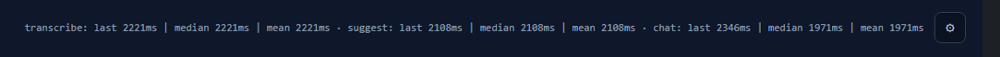
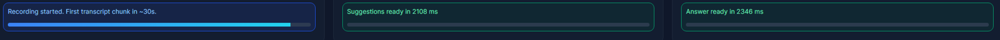
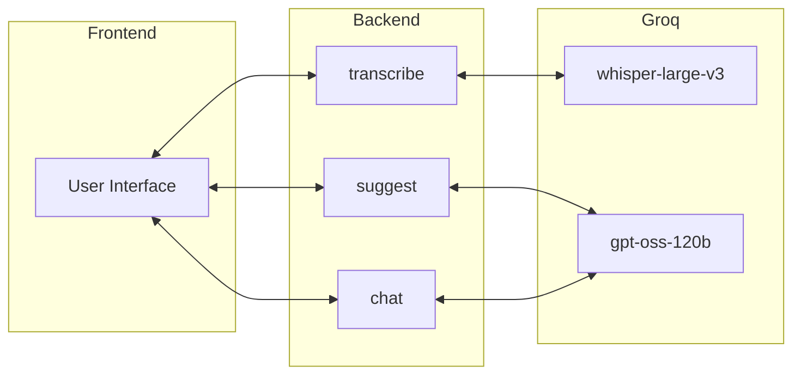
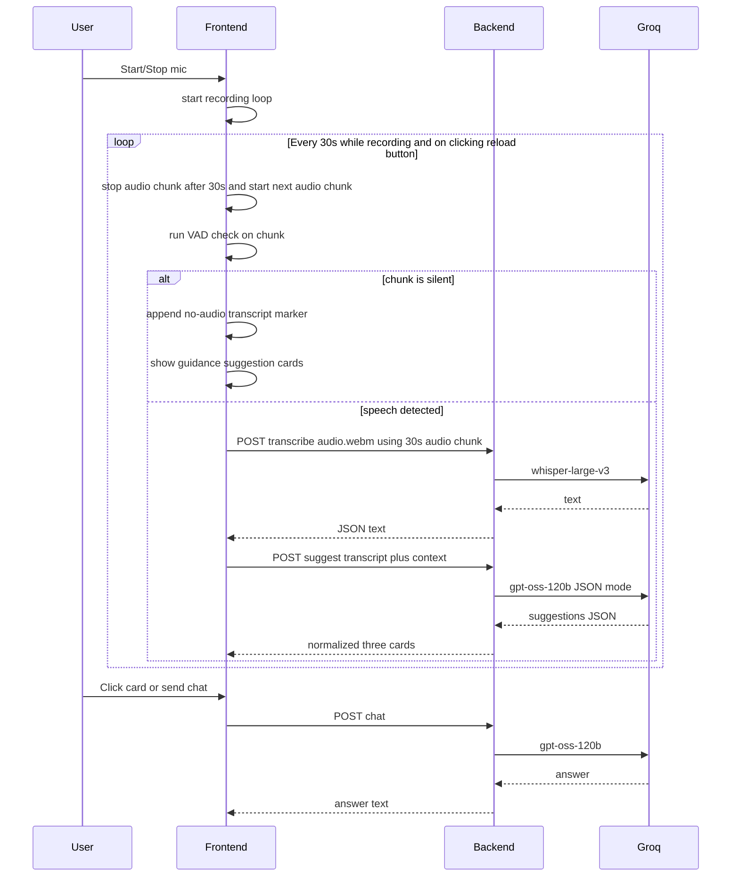

# TwinMind Live Suggestions

Web app that captures microphone audio during a conversation, transcribes it in timed chunks, requests three live suggestions from a language model, and opens a right-hand chat for longer answers when the user clicks a card or types a question. Session data lives in the browser only until the page is closed or refreshed.

## Submission

Frontend (Vercel): [twin-mind-live-copilot-satvik.vercel.app](https://twin-mind-live-copilot-satvik.vercel.app/)

Backend (Render): [https://twinmind-live-copilot.onrender.com](https://twinmind-live-copilot.onrender.com)

**IMPORTANT: The backend is located on the free tier of Render so it takes 60-90 seconds to start after mic button on is clicked. Please wait for the required time before using the program.**

## Stack

  Frontend: **React** with **Vite**. 

  Backend: **FastAPI** on **Python**. 

  Models: **Groq**: **whisper-large-v3** for transcription, **openai/gpt-oss-120b** for suggestions and chat.

## Prerequisites
  Before setting up the project, ensure you have the following installed and configured on your local machine:

  1. Environment & Runtimes
    - Python 3.10+: Required for the FastAPI backend.
    - Node.js (v18+) & npm: Necessary for the React/Vite frontend environment.
    - Virtual Environment: It is highly recommended to use venv or conda to isolate Python dependencies.

  2. API Access & Credentials
    - Groq API Key: You must have a valid API key from Groq Console.
    - This project utilizes whisper-large-v3 for transcription and gpt-oss-120b for the suggestion and chat engines.
    - Hardware Permissions: A working microphone and browser-level permission to access the MediaRecorder API (Chrome, Edge, or Firefox recommended).

  3. Network Requirements
    - Internet Connection: Required for real-time inference calls to Groq's cloud endpoints.
    - Port Availability: By default, the project uses port 8000 for the backend and 5173 for the frontend.

## Local setup
Clone and install:

```bash
git clone https://github.com/S-atvikSingh/TwinMind-Live-Copilot.git
cd TwinMind-Live-Copilot
```

Backend (from the `backend` directory): create a virtual environment, install dependencies with `pip install -r requirements.txt`, then run `python main.py`. The API listens on `http://localhost:8000` by default.

Frontend (from the `frontend` directory): run `npm install` and `npm run dev`. Open the URL Vite prints (typically `http://localhost:5173`). 

On the webpage open the settings and paste your Groq API key in Settings before starting the microphone.

## Live Deployment

Backend (Render):
- Deploy `backend` as a Python web service.
- Start command: `python main.py` (or an equivalent uvicorn command).
- Set `FRONTEND_ORIGINS` to your frontend domain(s), comma-separated.
  - Example: `https://twin-mind-live-copilot-satvik.vercel.app`

Frontend (Vercel):
- Import the GitHub repo into Vercel.
- Set **Root Directory** to `frontend`.
- Add environment variable `VITE_API_BASE=https://twinmind-live-copilot.onrender.com`.
- Build command `npm run build`, output directory `dist` (auto-detected for Vite).
- Redeploy after any environment variable changes.

Notes:
- Browsers require HTTPS for microphone access in production; Vercel/Render satisfy this.
- Before running the model, paste your Groq API key into the Settings panel.

## Behavior

- Recording uses a **30 second** `MediaRecorder` cycle: each stop sends one WebM chunk to `/transcribe`, appends the returned text to the transcript column with auto-scroll, then calls `/suggest` so the middle column always reflects the latest text. 

- **Reload suggestions** stops the current timer cycle early, transcribes the in-progress chunk, and runs the same suggest path. 

- New suggestion batches are **prepended** so the freshest three cards stay at the top. 

- Each card shows type, title, and a short preview; a click sends a structured question plus metadata to `/chat`. 

- The chat column is one continuous thread for the session and renders headings/lists for easier readability. New responses auto-scroll into view only when the user is already near the bottom, so manual scroll position is not interrupted.

- **Export session** downloads JSON containing the full transcript, all suggestion batches with timestamps, chat turns, optional prompt debug entries, and rolling latency samples.

- Client-side VAD evaluates chunk energy before transcription. If a chunk is too quiet, the transcript logs a no-audio marker and suggestion cards show mic guidance instead of model-generated content. 

- Browser page refresh/navigation now shows a native unsaved-session warning when transcript, suggestions, or chat contain data.

## Settings

- The Settings panel stores values in `localStorage`. 
- The user supplies the Groq API key only here; it is never committed to the repo. 
- Editable fields include the live suggestion system prompt, the typed chat system prompt, the detailed-answer prompt used when a suggestion is clicked, free-text context snippets prepended to suggestion and chat requests, character limits for the recent transcript slice used in suggestions versus chat, thresholds that control when older transcript is summarized into a short bullet list, and optional prompt debug export. 
- Defaults ship in `frontend/src/App.jsx` as `DEFAULT_SETTINGS`.
  
## Prompt strategy

TwinMind employs a multi-layered prompting architecture designed to transform raw transcripts into high-utility insights using instructional guardrails and few-shot calibration.

1. The "Real-Time Strategist" (Suggestion Engine)
  The suggestion engine is built on a Strict Instructional Framework to ensure that suggestions are useful, well timed & varied by context:

  -  Standalone Value Mandate: The prompt strictly forbids "promise-based" advice (e.g., "I can find the revenue growth"). Instead, it enforces a mandate where every suggestion must contain the actual insight or data point discovered (e.g., "Q2 revenue grew by 14% ($2.1M)").
   
  -  Few-Shot Calibration: I implemented complex Few-Shot Examples covering technical scenarios—such as identifying logic puzzles and correcting algorithmic inaccuracies (BFS vs. Dijkstra in weighted graphs). This serves as a calibration layer for the model's tone and technical depth.
   
  -  Type-Diversity Guardrails: The system requires a mandatory mix of at least two distinct cognitive categories (e.g., fact_check and talking_point) per batch, preventing the model from falling into repetitive instructional loops.

2. The "Senior Historian" (Chat & Detail Engine)
  The chat architecture focuses on providing detailed response to the user's inquiry or the selected suggestion.:

  -  Evidence-First Protocol: The model is explicitly instructed to lead with direct transcript evidence and speaker attribution (e.g., "The lead engineer mentioned..."), thus ensuring the results are based on evidence.
   
  -  Information Gap Identification: A specialized guardrail handles uncertainty. Instead of hallucinating, the model is trained to identify "blind spots"—explicitly stating what was not discussed and suggesting follow-up questions to bridge those gaps.
   
  -  CoT Expansion: When a user interacts with a suggestion card, the tm_detail_prompt triggers a specialized expansion, breaking down the high-level advice into a structured, executable plan grounded in the meeting's context.

3. Context Orchestration & Technical Resilience
  -   Dual-Window Slicing: The system utilizes a 7,000-character Full Context window for historical accuracy and a 1,200-character "Recency Boost" to prioritize immediate conversation  by default.

  -  State-Sync Integrity: By managing transcripts via React refs rather than batched state, the system ensures that the first suggestion batch of any session is fully grounded, solving the "empty-batch" initialization errors faced by me, which caused the first suggestion to be based on an empty transcript.
   
  -  Validation & Heuristic Loops: A robust client-server handshake rejects malformed JSON or repetitive titles, triggering an auto-retry loop (up to 4 attempts) to guarantee the user only interacts with high-signal, varied content.

## Tradeoffs

- Fixed 30-second chunks balance Whisper cost and latency against how quickly the transcript moves. Shorter chunks would react faster, but multiply API calls. 
- Client-side retries improve card quality without a second HTTP round-trip design, at the cost of worst-case latency when the model returns weak JSON. 
- Older context is summarized heuristically rather than sent in full, which keeps prompts within limits but can drop nuance from early in a long session. It could be summarized using a smaller model or by asking LLM itself, but that would also increase latency. 
- Suggestion quality checks run on the client as well as basic validation on the server, so the UI can degrade gracefully with a clear error if all attempts fail.

## User Interface


  Some details were added to the UI beyond the prototype to improve the user experience, for example:

  1. Latency Header
  
  - The header bar records the last, median, and mean round-trip times over the ten most recent calls each for transcribe, suggest, and chat.
  - Coarse progress indicators in each column reserve vertical space so status text does not shift the layout when states change.

  2. Progress Bars
  
  - The progress bars were added to the bottom of the page to show the time to render the transcription, suggestion cards and chats.
  - The progress bars make the whole system feel more responsive. 

## Repository layout

| Path | Role |
| --- | --- |
| `frontend/src/App.jsx` | Main app UI, mic/transcription loop, suggestions/chat orchestration, settings, VAD handling |
| `frontend/src/components/FixedStatus.jsx` | Reusable fixed-height status/progress component for each column |
| `frontend/src/utils/appUtils.js` | Shared utility helpers (`median`, `mean`, `nowTime`, HTTP detail formatting) |
| `frontend/src/main.jsx` | React entry point |
| `frontend/src/styles.css` | Layout, theming, modal/chat styling, status/progress visuals |
| `frontend/vite.config.js` | Vite configuration |
| `backend/main.py` | FastAPI app with `/transcribe`, `/suggest`, `/chat`, CORS origin handling |
| `backend/requirements.txt` | Runtime Python dependencies |
| `backend/requirements-dev.txt` | Dev/test dependencies (`pytest`, `httpx`) |
| `backend/tests/test_main.py` | Backend tests for parsing/quality validation, CORS config, `/suggest` route |
| `README.md` | Setup, deployment, behavior, prompt strategy, and architecture diagrams |

## Diagrams




