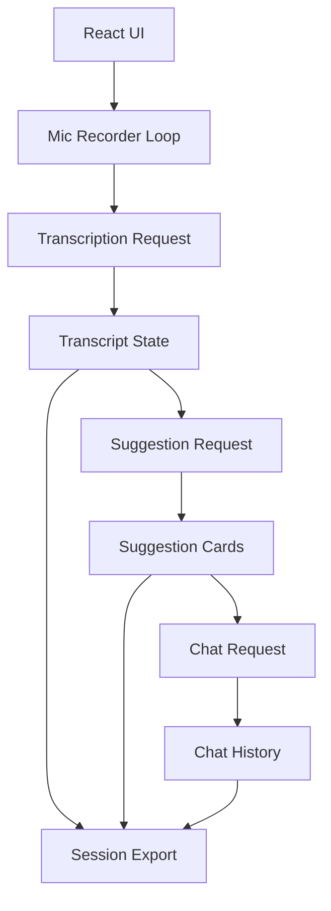
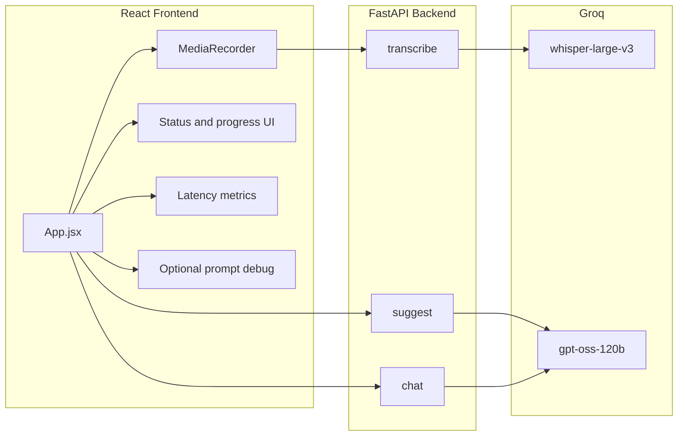
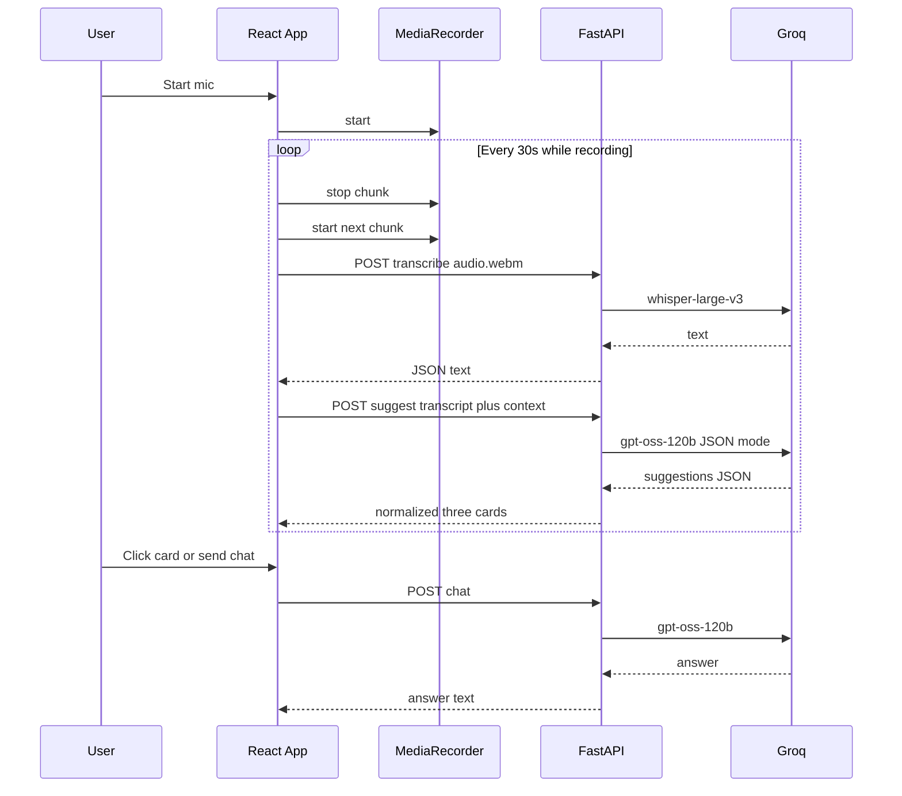

# TwinMind Live Suggestions

Web app that captures microphone audio during a conversation, transcribes it in timed chunks, requests three live suggestions from a language model, and opens a right-hand chat for longer answers when the user clicks a card or types a question. Session data lives in the browser only until the page is closed or refreshed.

## Submission

Live URL:

## Stack

The frontend is **React** with **Vite**. The backend is **FastAPI** on Python. All model calls go through **Groq**: **whisper-large-v3** for transcription and **openai/gpt-oss-120b** for suggestions and chat, matching the assignment model line.

## Local setup

Backend (from the `backend` directory): create a virtual environment, install dependencies with `pip install -r requirements.txt`, then run `python main.py`. The API listens on `http://localhost:8000` by default.

Frontend (from the `frontend` directory): run `npm install` and `npm run dev`. Open the URL Vite prints (typically `http://localhost:5173`). Paste your Groq API key in Settings before starting the microphone.

## Deployment

Run the FastAPI app on a host that exposes HTTPS and note its origin for CORS (the backend allows all origins for this prototype). Build the frontend with `npm run build` and serve the `dist` folder. Set the environment variable `VITE_API_BASE` at build time to your public API origin (for example `https://api.example.com`) so the browser calls your deployed backend instead of `http://localhost:8000`.

## Behavior

Recording uses a **30 second** `MediaRecorder` cycle: each stop sends one WebM chunk to `/transcribe`, appends the returned text to the transcript column with auto-scroll, then calls `/suggest` so the middle column always reflects the latest text. **Reload suggestions** stops the current timer cycle early, transcribes the in-progress chunk, and runs the same suggest path. New suggestion batches are **prepended** so the freshest three cards stay at the top. Each card shows type, title, and a short preview; a click sends a structured question plus metadata to `/chat`. The chat column is one continuous thread for the session. **Export session** downloads JSON containing the full transcript, all suggestion batches with timestamps, chat turns, optional prompt debug entries, and rolling latency samples.

## Settings

The Settings panel stores values in `localStorage`. The user supplies the Groq API key only here; it is never committed to the repo. Editable fields include the live suggestion system prompt, the typed chat system prompt, the detailed-answer prompt used when a suggestion is clicked, free-text context snippets prepended to suggestion and chat requests, character limits for the recent transcript slice used in suggestions versus chat, thresholds that control when older transcript is summarized into a short bullet list, and optional prompt debug export. Defaults ship in `frontend/src/App.jsx` as `DEFAULT_SETTINGS`.

## Prompt strategy

Suggestions use a strict JSON object response shape from Groq. The system message is the long assignment-style prompt (types, standalone previews, grounding). The user message sent by the backend combines the recent transcript window (last N characters, default 4000) with a structured context block built on the client: configurable timing guidance, a recency-biased excerpt, optional compressed older context when the session is long, the last two suggestion batches serialized so the model avoids repeating themes, and light heuristics (for example sequence or puzzle phrasing) that nudge toward concrete answers. The client may retry the suggest call up to four times until local quality checks pass (three items, at least two distinct types, three distinct titles). Chat requests send a similar recent window (default 7000 characters for chat) plus recency boost text, older summary when applicable, and for card clicks a block with the suggestion type, title, preview, and reason. Transcript text used in API calls is kept in a ref updated immediately after each transcribe response so the first suggestion batch after a chunk is never empty due to React state batching.

The backend parses JSON, normalizes types to the allowed set, trims lengths, and rejects responses that are not exactly three suggestions, that reuse titles, or that collapse to a single suggestion type, which triggers the client retry loop.

## Tradeoffs

Fixed 30 second chunks balance Whisper cost and latency against how quickly the transcript moves; shorter chunks would react faster but multiply API calls. Client-side retries improve card quality without a second HTTP round-trip design, at the cost of worst-case latency when the model returns weak JSON. Older context is summarized heuristically rather than sent in full, which keeps prompts within limits but can drop nuance from early in a long session. Suggestion quality checks run on the client as well as basic validation on the server so the UI can degrade gracefully with a clear error if all attempts fail.

## Latency

The header bar records the last, median, and mean round-trip times over the ten most recent calls each for transcribe, suggest, and chat. Coarse progress indicators in each column reserve vertical space so status text does not shift the layout when states change.

## UI

## Repository layout

| Path | Role |
| --- | --- |
| `frontend/src/App.jsx` | UI, mic loop, prompts, export, API orchestration |
| `frontend/src/main.jsx` | React entry |
| `frontend/src/styles.css` | Three-column layout and fixed status regions |
| `frontend/vite.config.js` | Vite configuration |
| `backend/main.py` | `/transcribe`, `/suggest`, `/chat` routes and Groq integration |

## Diagrams

