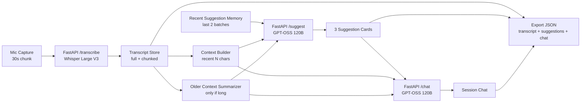

# TwinMind Live Suggestions (Offline Local Version)

A local-first implementation of the TwinMind assessment:
- live mic capture
- rolling transcript updates
- 3 live suggestions per refresh cycle
- click-to-expand detailed answers in a session chat
- full session export for evaluation

This version is optimized for running and testing on a local machine.

## Local Run

## 1) Backend

```bash
cd backend
python -m venv .venv
.venv\Scripts\activate
pip install -r requirements.txt
python main.py
```

Backend runs at `http://localhost:8000`.

## 2) Frontend

Serve `frontend/index.html` from any static server (or open directly in browser if your environment allows mic + fetch to localhost).

Example:

```bash
cd frontend
python -m http.server 5500
```

Then open `http://localhost:5500`.

## Settings

Use the settings modal (`⚙️`) and provide your own Groq API key.

No API key is hard-coded in source. The key is stored in browser `localStorage` as `tm_key` for local testing only.

Configurable values:
- suggestions prompt
- chat prompt
- suggestions context guidance
- chat context guidance
- suggestion context window (`last N characters`)
- chat context window (`last N characters`)
- prompt debug toggle (shows latest payload used for suggest/chat)

The app also seeds default prompt/context values on first load.

## Stack Choices

- Frontend: HTML + Tailwind CDN + vanilla JavaScript
- Backend: FastAPI (`Python`)
- Model provider: Groq
  - Transcription: `whisper-large-v3`
  - Suggestions: `openai/gpt-oss-120b`
  - Chat: `openai/gpt-oss-120b`

Reasons:
- I used vanilla JS because the project has only one page which can be quickly built and debugged with JS.
- The groq models were used as required by the assignment
- Backend was built with python as that is my language of choice.

## Architecture + Tradeoff Diagram



Tradeoff choices:
- Recent-window first improves latency and relevance for live moments.
- Older-summary fallback preserves long-range context without sending full transcript each request.
- Previous-suggestion memory improves variation and reduces repeated cards.
- Kept local/session-only storage to match assignment scope and avoid persistence complexity.
- isFirstRecordingCycle was used to dispaly first transcript very quickly so that user can immediatly see the recording is working rather than waiting for the transcript for a long time.

## Prompt Strategy

## Live Suggestions Prompt

Goals:
- produce exactly 3 suggestions every cycle
- maximize immediate usefulness (preview itself should add value)
- diversify suggestion types (question, talking point, answer, fact-check, clarification)

Design choices:
- strict JSON output requirement for parse reliability
- explicit schema (`type`, `title`, `preview`, `reason`)
- constraints to reduce verbose/generic responses
- context instruction to prioritize recent conversation
- context size can be set by the user with the default being 4000 characters

## Detailed Answer Prompt

Goals:
- turn clicked suggestion into practical, longer-form help
- ground response in transcript context
- keep result concise enough for live usage

Design choices:
- separate prompt from live suggestion prompt
- include transcript + chat context
- uncertainty behavior: state missing info instead of fabricating
- context size can be set by the user with the default being 7000 characters

## Assignment Checklist (Current Status)

## Mic + transcript

- Start/stop mic button: **PASS**
- Transcript appends in chunks roughly every 30s: **PASS**
- Auto-scroll to latest line: **PASS**

## Live suggestions

- Transcript and suggestions auto-refresh every ~30s: **PASS**
- Manual refresh button: **PASS**
- Exactly 3 fresh suggestions per refresh: **PASS** (validated server-side)
- New batch at top, older below: **PASS**
- Tappable cards with useful preview + expanded details on click: **PASS**
- Suggestion quality and contextual mix: **PARTIAL** (works, but can improve with more testing)

## Chat

- Clicking suggestion adds to chat and returns detailed answer: **PASS**
- User can ask direct questions: **PASS**
- Single in-session chat, no persistence across reload: **PASS**

## Export

- Export transcript + suggestion batches + full chat with timestamps: **PASS**

## Technical requirements

- Groq models used as required: **PASS**
- User-provided API key in settings: **PASS**
- Editable prompts/settings with defaults: **PASS**
- Deployment (public URL): **NOT DONE** (local/offline scope currently)

## Module responsibilities

- `js/state.js`: session state and default settings seeding.
- `js/ui.js`: rendering, banners, button loading states, prompt debug output.
- `js/context.js`: context slicing, recency boost, summarization, suggestion quality checks.
- `js/api.js`: shared HTTP wrapper and status-code error mapping.
- `js/app.js`: orchestration of audio loop, suggest/chat calls, settings, export.

## Tradeoffs (offline version)

- Chose localStorage for fast iteration and no backend auth complexity.
- Chose strict JSON contracts to avoid frontend parsing instability.
- Chose 30s cycle for assignment compliance over lower-latency micro-chunks.
- Kept UI simple to focus effort on prompting, context flow, and reliability.
