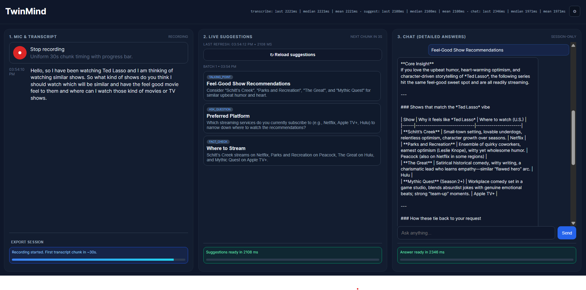
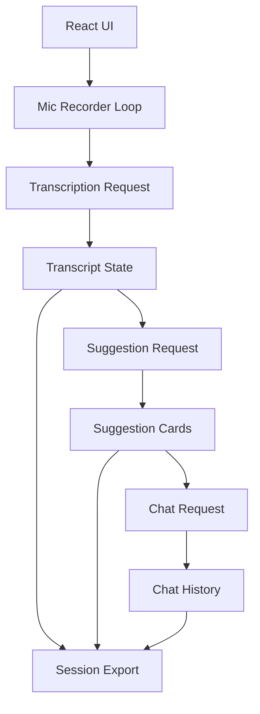
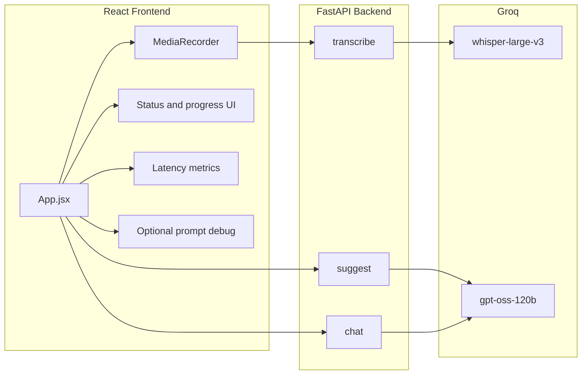
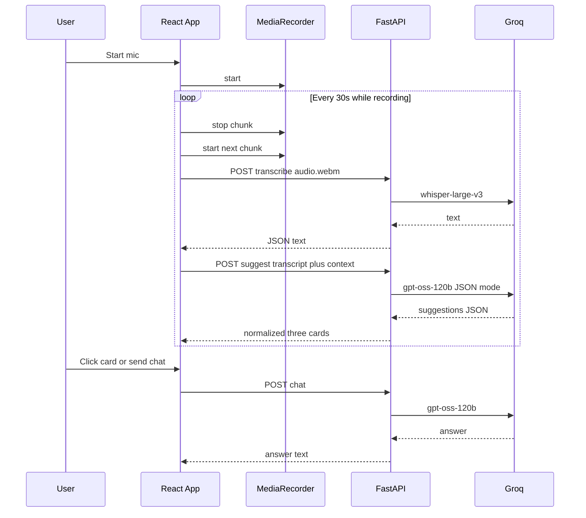

# TwinMind Live Suggestions

Web app that captures microphone audio during a conversation, transcribes it in timed chunks, requests three live suggestions from a language model, and opens a right-hand chat for longer answers when the user clicks a card or types a question. Session data lives in the browser only until the page is closed or refreshed.

## Submission

Live URL:

Frontend (Vercel): [twin-mind-live-copilot-satvik.vercel.app](https://twin-mind-live-copilot-satvik.vercel.app/)

Backend (Render): [https://twinmind-live-copilot.onrender.com](https://twinmind-live-copilot.onrender.com)

## Stack

The frontend is **React** with **Vite**. The backend is **FastAPI** on Python. All model calls go through **Groq**: **whisper-large-v3** for transcription and **openai/gpt-oss-120b** for suggestions and chat, matching the assignment model line.

## Local setup
Clone and install:

```bash
git clone https://github.com/S-atvikSingh/TwinMind-Live-Copilot.git
cd TwinMind-Live-Copilot
```

Backend (from the `backend` directory): create a virtual environment, install dependencies with `pip install -r requirements.txt`, then run `python main.py`. The API listens on `http://localhost:8000` by default.

Frontend (from the `frontend` directory): run `npm install` and `npm run dev`. Open the URL Vite prints (typically `http://localhost:5173`). Paste your Groq API key in Settings before starting the microphone.

## Deployment

Backend (Render):
- Deploy `backend` as a Python web service.
- Start command: `python main.py` (or an equivalent uvicorn command).
- Set `FRONTEND_ORIGINS` to your frontend domain(s), comma-separated.
  - Example: `https://twin-mind-live-copilot-satvik.vercel.app`

Frontend (Vercel):
- Import the GitHub repo into Vercel.
- Set **Root Directory** to `frontend`.
- Add environment variable `VITE_API_BASE=https://twinmind-live-copilot.onrender.com`.
- Build command `npm run build`, output directory `dist` (auto-detected for Vite).
- Redeploy after any environment variable changes.

Notes:
- Browsers require HTTPS for microphone access in production; Vercel/Render satisfy this.
- Before running the model, paste your Groq API key into the Settings panel.

## Behavior

Recording uses a **30 second** `MediaRecorder` cycle: each stop sends one WebM chunk to `/transcribe`, appends the returned text to the transcript column with auto-scroll, then calls `/suggest` so the middle column always reflects the latest text. **Reload suggestions** stops the current timer cycle early, transcribes the in-progress chunk, and runs the same suggest path. New suggestion batches are **prepended** so the freshest three cards stay at the top. Each card shows type, title, and a short preview; a click sends a structured question plus metadata to `/chat`. The chat column is one continuous thread for the session. **Export session** downloads JSON containing the full transcript, all suggestion batches with timestamps, chat turns, optional prompt debug entries, and rolling latency samples.

## Settings

The Settings panel stores values in `localStorage`. The user supplies the Groq API key only here; it is never committed to the repo. Editable fields include the live suggestion system prompt, the typed chat system prompt, the detailed-answer prompt used when a suggestion is clicked, free-text context snippets prepended to suggestion and chat requests, character limits for the recent transcript slice used in suggestions versus chat, thresholds that control when older transcript is summarized into a short bullet list, and optional prompt debug export. Defaults ship in `frontend/src/App.jsx` as `DEFAULT_SETTINGS`.

## Prompt strategy

TwinMind employs a multi-layered prompting architecture designed to transform raw transcripts into high-utility executive insights using instructional guardrails and few-shot calibration.

1. The "Real-Time Strategist" (Suggestion Engine)
  The suggestion engine is built on a Strict Instructional Framework to ensure zero-latency value:

    Standalone Value Mandate: The prompt strictly forbids "promise-based" advice (e.g., "I can find the revenue growth"). Instead, it enforces a mandate where every suggestion must contain the actual insight or data point discovered (e.g., "Q2 revenue grew by 14% ($2.1M)").
   
    Few-Shot Calibration: I implemented complex Few-Shot Examples covering technical scenarios—such as identifying logic puzzles and correcting algorithmic inaccuracies (BFS vs. Dijkstra in weighted graphs). This serves as a calibration layer for the model's tone and technical depth.
   
    Type-Diversity Guardrails: The system requires a mandatory mix of at least two distinct cognitive categories (e.g., fact_check and talking_point) per batch, preventing the model from falling into repetitive instructional loops.

3. The "Senior Historian" (Chat & Detail Engine)
  The chat architecture focuses on Deep-Context Synthesis and Audit-Grade Evidence:

    Evidence-First Protocol: The model is explicitly instructed to lead with direct transcript evidence and speaker attribution (e.g., "The lead engineer mentioned..."), turning the assistant into a verified meeting auditor.
   
    Information Gap Identification: A specialized guardrail handles uncertainty. Instead of hallucinating, the model is trained to identify "blind spots"—explicitly stating what was not discussed and suggesting follow-up questions to bridge those gaps.
   
    CoT Expansion: When a user interacts with a suggestion card, the tm_detail_prompt triggers a specialized expansion, breaking down the high-level advice into a structured, executable plan grounded in the meeting's specific trajectory.

5. Context Orchestration & Technical Resilience
  Dual-Window Slicing: The system utilizes a 7,000-character Full Context window for historical accuracy and a 1,200-character "Recency Boost" to prioritize immediate conversation turns.

    State-Sync Integrity: By managing transcripts via React refs rather than batched state, the system ensures that the first suggestion batch of any session is fully grounded, solving common "empty-batch" initialization errors.
   
    Validation & Heuristic Loops: A robust client-server handshake rejects malformed JSON or repetitive titles, triggering an auto-retry loop (up to 4 attempts) to guarantee the user only interacts with high-signal, varied content.

## Tradeoffs

Fixed 30 second chunks balance Whisper cost and latency against how quickly the transcript moves; shorter chunks would react faster but multiply API calls. Client-side retries improve card quality without a second HTTP round-trip design, at the cost of worst-case latency when the model returns weak JSON. Older context is summarized heuristically rather than sent in full, which keeps prompts within limits but can drop nuance from early in a long session. Suggestion quality checks run on the client as well as basic validation on the server so the UI can degrade gracefully with a clear error if all attempts fail.

## Latency

The header bar records the last, median, and mean round-trip times over the ten most recent calls each for transcribe, suggest, and chat. Coarse progress indicators in each column reserve vertical space so status text does not shift the layout when states change.

## UI



## Repository layout

| Path | Role |
| --- | --- |
| `frontend/src/App.jsx` | UI, mic loop, prompts, export, API orchestration |
| `frontend/src/main.jsx` | React entry |
| `frontend/src/styles.css` | Three-column layout and fixed status regions |
| `frontend/vite.config.js` | Vite configuration |
| `backend/main.py` | `/transcribe`, `/suggest`, `/chat` routes and Groq integration |

## Diagrams






